# Lottus Dream

Lottus Dream es un proyecto creado para la sumativa n°1 de la asignatura Programacion Web de la carrera Analista Programador Computacional en DuocUc.

## Descripción de la idea

Lottus Dream es una empresa que arrienda instalaciones para la realización de eventos de tipo social y empresarial.
Cuenta con 2 tipos de roles: Cliente y Administración, los cuales se diferencian por el tipo de login que tienen.

+ Si quien inicia sesion es un cliente tendra la siguiente vista:
    + Datos de prueba: usuario/usuario
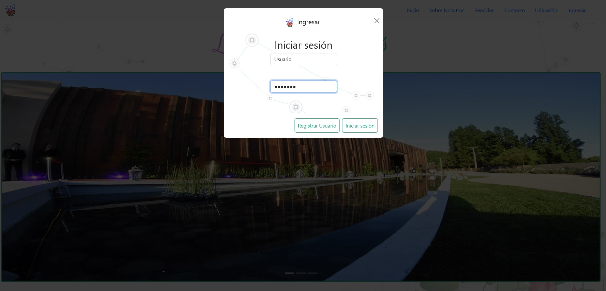
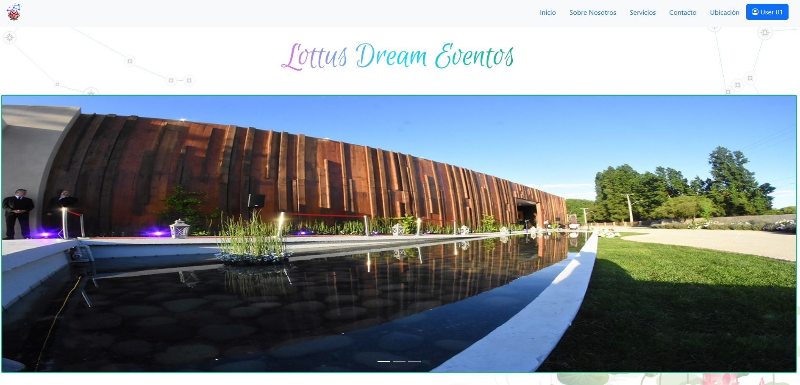

(Para deslogear al usuario cliente solo debe presionar en su nombre -> ir a su perfil y desde ahi se cierra sesión)

+ Si quien inicia sesión es un administrador tendra la siguiente vista:
    + Datos de prueba: admin/admin
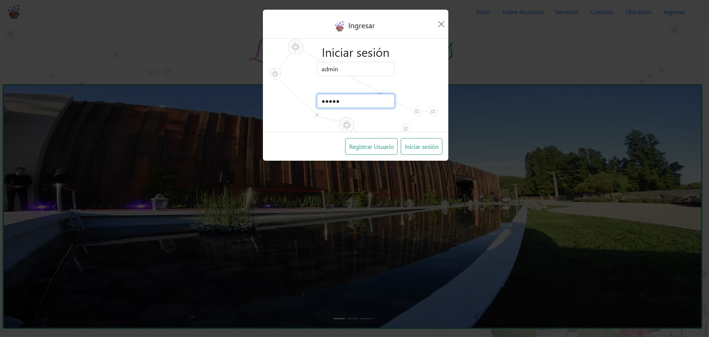
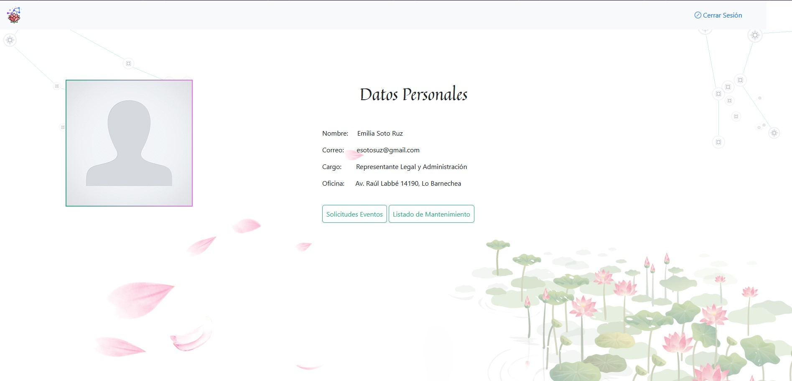

(Para deslogear al usuario administrador solo debe presionar en cerrar sesión)

## Lo requerido
+ Inicio de sesión
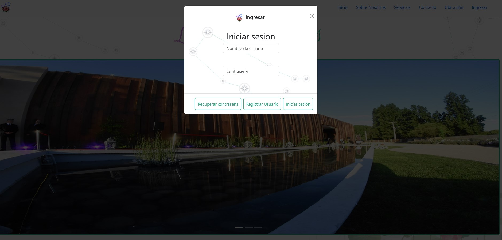
+ Registro de usuarios
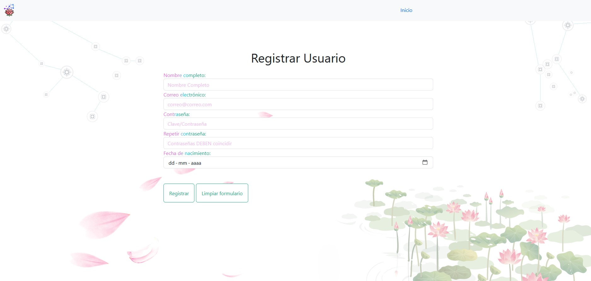
+ Contraseña con 4 validaciones (dentro del app.js estan las validaciones mencionadas en ese tooltip)
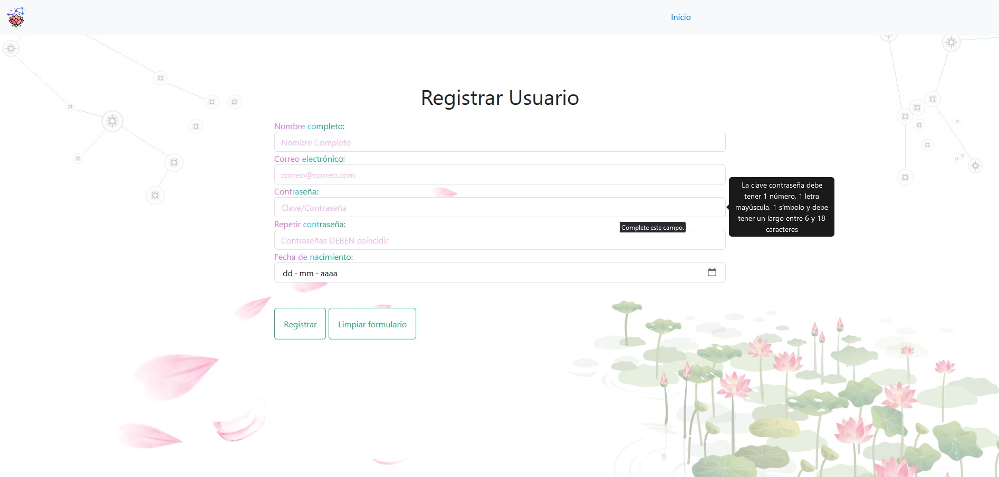
+ Recuperar contraseña
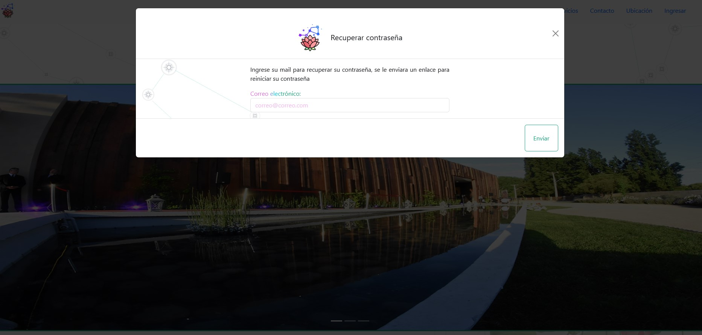
+ Modificacion de perfil
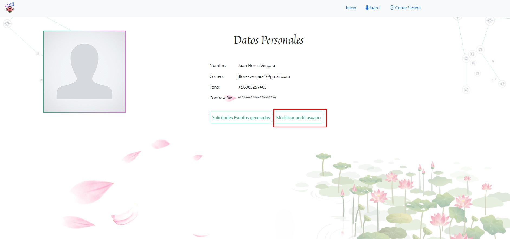
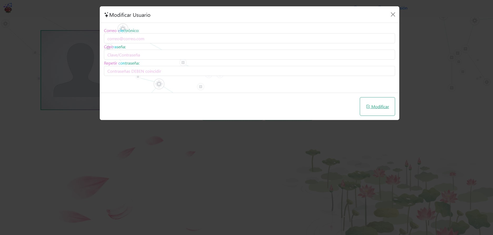
+ Para la tematica de arriendos:
    + Visualización o monitoreo de compras asociadas al usuario que inició sesión
    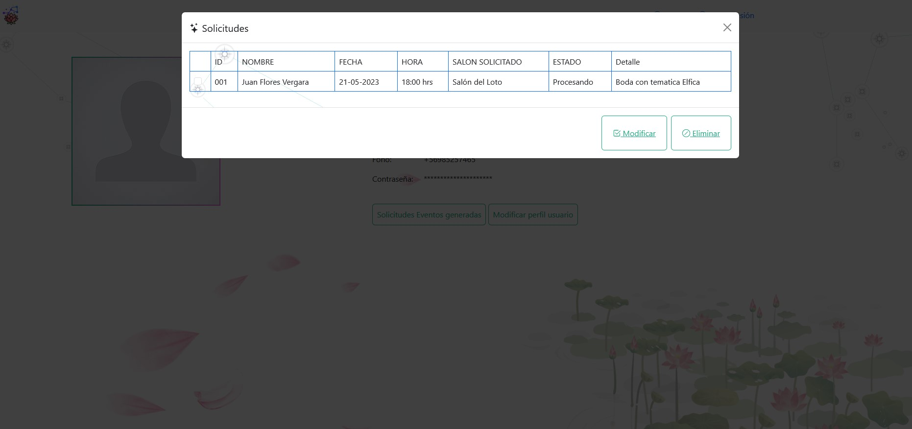
    + Se deben crear mantenedores para la información relativa al cliente, usuarios, productos y manejo de inventario
    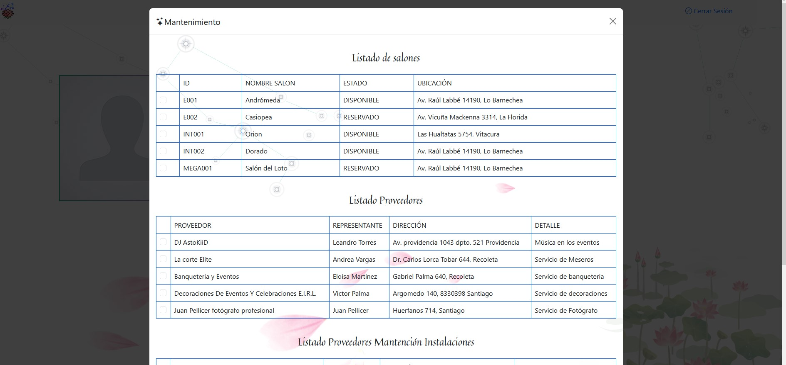